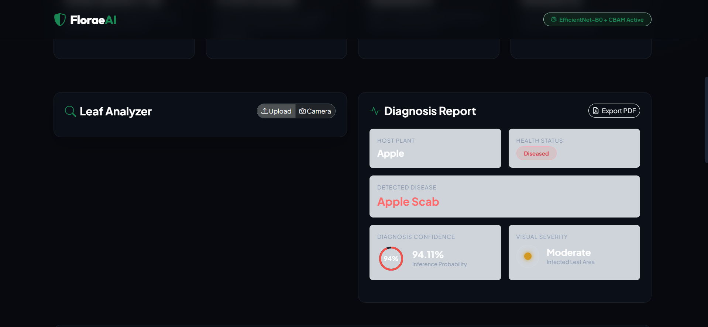
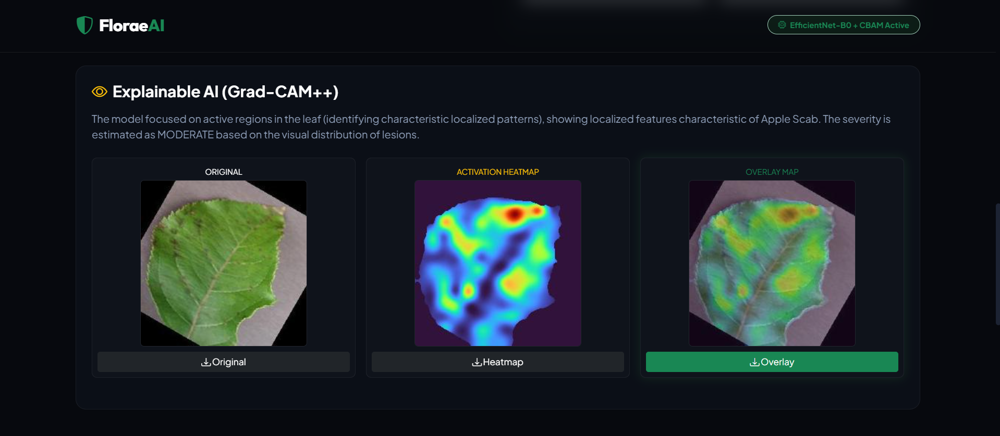
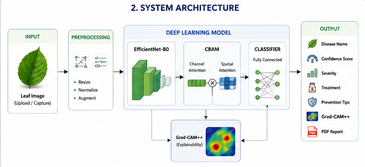
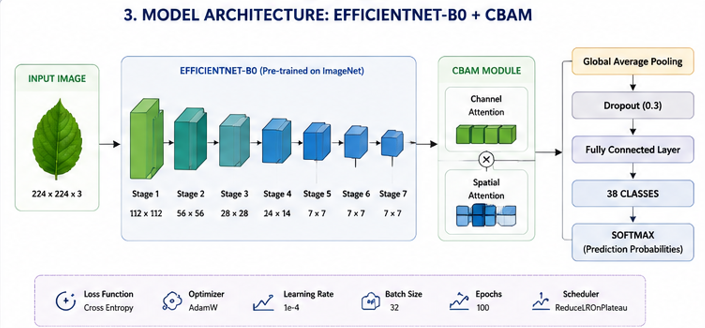
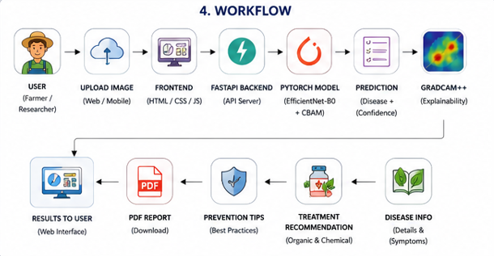
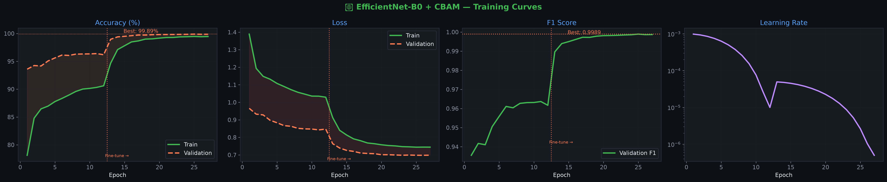
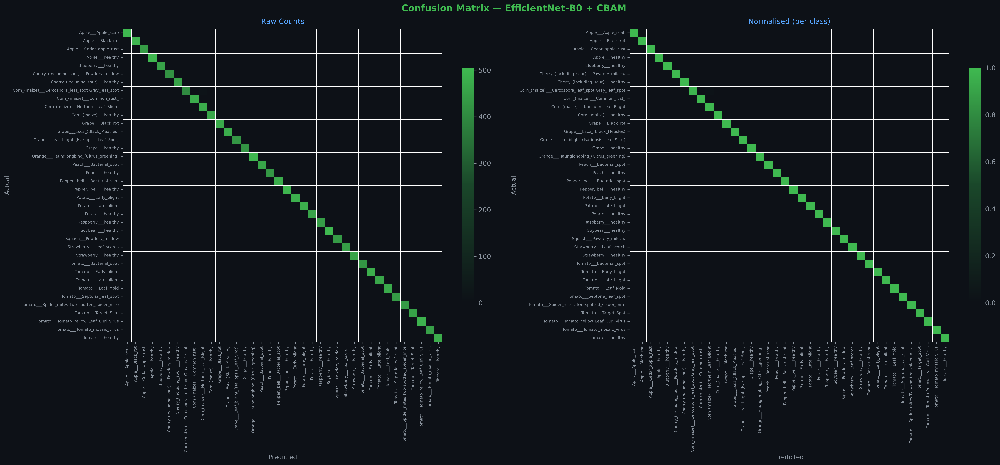
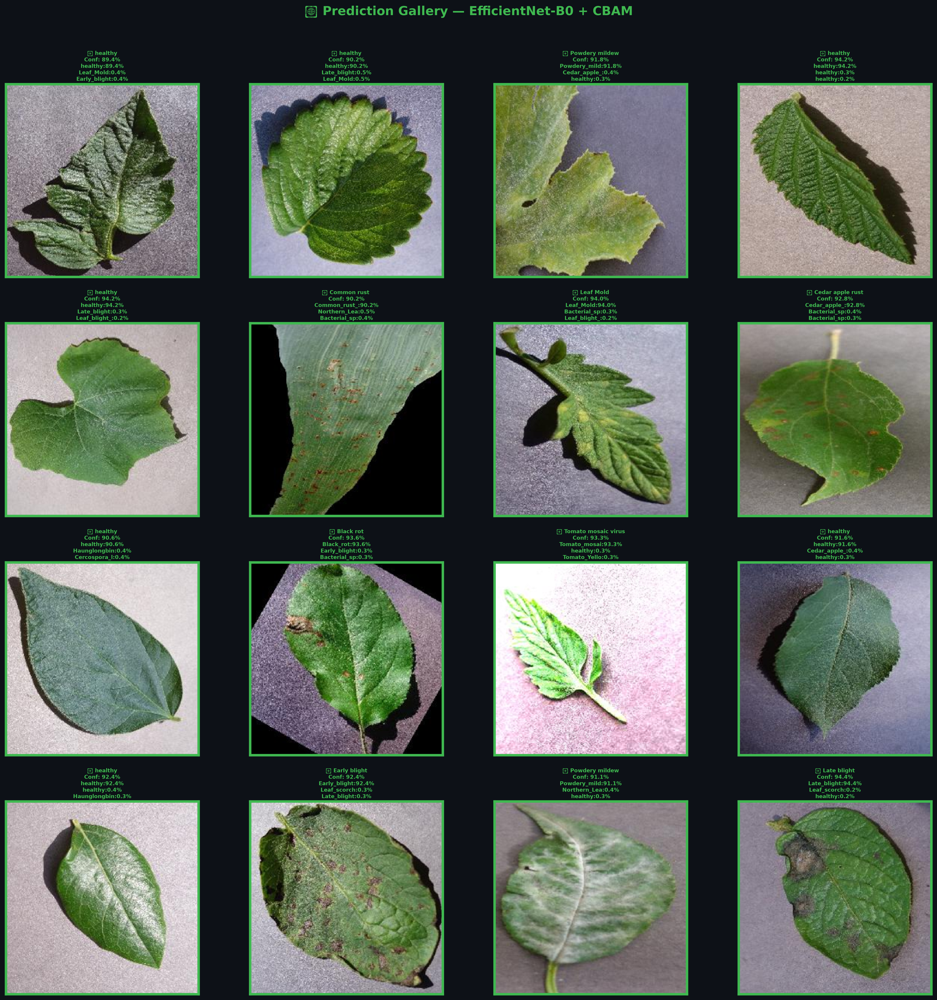

<p align="center">

&#x20; 

</p>


<div align="center">


\# 🌿 Deep Learning Based Plant Disease Detection


\### Using EfficientNet-B0 + CBAM with Explainable AI (Grad-CAM++)


An IEEE Research Project for Accurate Plant Disease Classification using Deep Learning, Attention Mechanisms, and Explainable Artificial Intelligence.


</div>


\---


<div align="center">


!\[Python](https://img.shields.io/badge/Python-3.10-blue?style=for-the-badge\&logo=python)

!\[PyTorch](https://img.shields.io/badge/PyTorch-2.x-red?style=for-the-badge\&logo=pytorch)

!\[FastAPI](https://img.shields.io/badge/FastAPI-Backend-009688?style=for-the-badge\&logo=fastapi)

!\[License](https://img.shields.io/badge/License-MIT-yellow?style=for-the-badge)

!\[IEEE](https://img.shields.io/badge/IEEE-Research-orange?style=for-the-badge)

!\[GradCAM++](https://img.shields.io/badge/XAI-GradCAM++-purple?style=for-the-badge)


</div>


\---


\# 🌐 Live Demo


🚀 \*\*Try the deployed application here:\*\*


\*\*Hugging Face Space:\*\*  

https://thebeat7-plant-disease-scanner.hf.space


\---


\# 📖 Project Overview


Plant diseases are one of the major causes of crop yield reduction worldwide. Early and accurate disease diagnosis helps farmers take timely preventive measures, reducing economic losses and improving agricultural productivity.


This project presents an intelligent plant disease detection system using deep learning, where \*\*EfficientNet-B0\*\* is enhanced with the \*\*Convolutional Block Attention Module (CBAM)\*\* to improve feature extraction and classification performance. To increase transparency and user trust, \*\*Grad-CAM++\*\* is integrated to visualize the regions of the leaf responsible for each prediction.


The complete system includes a responsive web application, an optimized deep learning model, explainable AI visualizations, and disease treatment recommendations.


The proposed model achieved a classification accuracy of \*\*99.89%\*\* on the New Plant Diseases Dataset (Augmented), outperforming both the Custom CNN baseline and the standard EfficientNet-B0 model.


\---


\# ✨ Features


\- 🌿 Detects \*\*38 plant leaf disease classes\*\*

\- 🧠 EfficientNet-B0 + CBAM based deep learning architecture

\- 🔥 Explainable AI using Grad-CAM++

\- 📈 99.89% classification accuracy

\- ⚡ FastAPI backend for high-performance inference

\- 🌐 Modern responsive web interface

\- 📸 Upload plant leaf images for diagnosis

\- 🎯 Displays Top-5 prediction probabilities

\- 🩺 Disease description and treatment recommendations

\- 📊 Performance comparison of multiple deep learning models

\- 📈 Interactive visualizations and evaluation metrics

\- ☁️ Deployable on Hugging Face Spaces


\---


\# 📸 Project Screenshots


\## Home Page


<p align="center">


</p>


\## Prediction Result


<p align="center">



</p>


\## Grad-CAM++ Explainability


<p align="center">



</p>


\---


\# 🛠️ Technology Stack


| Category | Technology |

|-----------|------------|

| Programming Language | Python |

| Deep Learning | PyTorch |

| Backbone Model | EfficientNet-B0 |

| Attention Module | CBAM |

| Explainable AI | Grad-CAM++ |

| Backend | FastAPI |

| Frontend | HTML, CSS, JavaScript |

| Deployment | Hugging Face Spaces |

| Version Control | Git \& GitHub |


\---


\# 🏗️ System Architecture


The proposed system consists of a complete end-to-end pipeline, beginning with image acquisition and ending with disease prediction, explainability, and treatment recommendation.


<p align="center">

&#x20; 

</p>


\---


\# 🧠 Proposed Model Architecture


The proposed model enhances EfficientNet-B0 by integrating the Convolutional Block Attention Module (CBAM). This enables the network to focus on the most informative spatial and channel-wise features while suppressing irrelevant information.


<p align="center">

&#x20; 

</p>


\---


\# 🔄 Workflow


The workflow of the proposed plant disease detection system is illustrated below.


<p align="center">

&#x20; 

</p>


\---


\# 📂 Repository Structure


```text

Plant-Disease-Detection-EfficientNetB0-CBAM/

│

├── assets/

│   ├── banner/

│   ├── screenshots/

│   ├── architecture/

│   ├── workflow/

│   └── demo/

│

├── backend/

├── frontend/

├── website/

├── models/

├── notebooks/

├── dataset/

├── docs/

├── results/

│

├── README.md

├── requirements.txt

├── .gitignore

├── LICENSE

└── CITATION.cff

```


\---


\# 📊 Dataset


The model was trained and evaluated using the \*\*New Plant Diseases Dataset (Augmented)\*\*.


\### Dataset Summary


| Property | Value |

|----------|-------|

| Total Classes | 38 |

| Healthy Classes | 14 |

| Diseased Classes | 24 |

| Image Size | 224 × 224 |

| Color Space | RGB |

| Split | Train / Validation |


\### Data Augmentation


\- Random Crop

\- Horizontal Flip

\- Vertical Flip

\- Random Rotation

\- Color Jitter

\- Random Perspective

\- Random Erasing

\- MixUp


\---


\# 📈 Model Performance Comparison


Three deep learning models were trained and evaluated on the New Plant Diseases Dataset to analyze the effectiveness of the proposed approach.


| Model | Accuracy | Precision | Recall | F1-Score | Cohen Kappa | MCC |
|-------|---------:|----------:|-------:|---------:|------------:|----:|
| Custom CNN | 98.86% | 98.86% | 98.86% | 98.86% | 0.9883 | 0.9883 |
| EfficientNet-B0 | 99.71% | 99.71% | 99.71% | 99.71% | 0.9970 | 0.9970 |
| **EfficientNet-B0 + CBAM (Proposed)** | **99.89%** | **99.89%** | **99.89%** | **99.89%** | **0.9989** | **0.9989** |

| Model | Accuracy | Parameters | Training Time |
|-------|---------:|-----------:|--------------:|
| Custom CNN | 98.86% | 10,477,542 | 404.1 min |
| EfficientNet-B0 | 99.71% | 4,804,514 | 40.6 min |
| **EfficientNet-B0 + CBAM (Proposed)** | **99.89%** | **5,010,948** | **42.6 min** |

The proposed EfficientNet-B0 + CBAM model achieved the best overall performance across all evaluation metrics.


\# 📉 Training Curves


\### Proposed EfficientNet-B0 + CBAM


<p align="center">



</p>


The training and validation curves demonstrate stable convergence with minimal overfitting.


\# 🎯 Confusion Matrix


<p align="center">



</p>


The proposed model correctly classified the majority of disease categories with very few misclassifications.


\# 🔥 Explainable AI (Grad-CAM++)


Grad-CAM++ is used to visualize the regions of the leaf image responsible for the model's prediction.


<p align="center">


</p>


The heatmap confirms that the proposed model focuses primarily on infected leaf regions instead of background pixels, improving model interpretability.


\# 🌿 Prediction Gallery


<p align="center">



</p>


Example predictions generated by the proposed EfficientNet-B0 + CBAM model.


\# 🌐 Web Application


The proposed model is integrated into a modern web application developed using FastAPI, HTML, CSS and JavaScript.


\## Features


\- Upload plant leaf images

\- Camera capture

\- Real-time prediction

\- Confidence score

\- Disease information

\- Treatment recommendation

\- Grad-CAM visualization

\- PDF report generation

\- Prediction history


\# ⚙️ Installation


\## 1. Clone the Repository


```bash

git clone https://github.com/The-best7/Plant-Disease-Detection-EfficientNetB0-CBAM.git

```


\## 2. Navigate to the Project Folder


```bash

cd Plant-Disease-Detection-EfficientNetB0-CBAM

```


\## 3. Install Dependencies


```bash

pip install -r requirements.txt

```


\## 4. Run the Backend


```bash

uvicorn backend.main:app --reload

```


\## 5. Open in Browser


```

http://127.0.0.1:8000

```


\---


\# 🚀 Usage


1\. Open the web application.

2\. Upload a plant leaf image or capture one using the camera.

3\. Click \*\*Analyze Leaf Health\*\*.

4\. Wait for the model to complete inference.

5\. View:

&#x20;  - Plant Name

&#x20;  - Disease Name

&#x20;  - Confidence Score

&#x20;  - Disease Severity

&#x20;  - Grad-CAM++ Heatmap

&#x20;  - Disease Description

&#x20;  - Organic \& Chemical Treatment

6\. Export the report as PDF if required.


\---


\# 🌐 API Endpoints


| Method | Endpoint | Description |

|---------|----------|-------------|

| GET | `/` | Home Page |

| POST | `/predict` | Predict Plant Disease |

| GET | `/health` | Health Check |

| GET | `/docs` | FastAPI Swagger Documentation |


\---


\# 📁 Repository Structure


```text

Plant-Disease-Detection-EfficientNetB0-CBAM/

│

├── assets/

│   ├── architecture/

│   ├── banner/

│   ├── demo/

│   ├── results/

│   ├── screenshots/

│   └── workflow/

│

├── backend/

├── dataset/

├── docs/

├── frontend/

├── models/

├── notebooks/

├── results/

├── website/

│

├── README.md

├── requirements.txt

├── LICENSE

├── .gitignore

└── CITATION.cff

```


\---


\# 🚀 Future Improvements


\- Mobile Application Development

\- Support for Additional Crop Species

\- Disease Severity Quantification

\- Cloud-Based Inference

\- Multi-Language Support

\- Integration with IoT Smart Farming Devices

\- Real-Time Video Disease Detection

\- Federated Learning for Privacy-Preserving Model Updates


\---


\# 📚 Citation


If you use this repository in your research, please cite:


```bibtex

@software{plant\_disease\_detection,

&#x20; title={Deep Learning Based Plant Disease Detection using EfficientNet-B0 with CBAM and Explainable AI},

&#x20; author={Kartik Tomar},

&#x20; year={2026}

}

```


\---


\# 📜 License


This project is licensed under the \*\*MIT License\*\*.


See the LICENSE file for details.


\---


\# 🙏 Acknowledgements


\- PyTorch

\- FastAPI

\- TIMM Library

\- OpenCV

\- PlantVillage \& New Plant Diseases Dataset

\- Hugging Face Spaces

\- The research community for advancing Explainable Artificial Intelligence (XAI)


\---


\# 📬 Contact


\*\*Author:\*\* Kartik Tomar


GitHub: https://github.com/The-best7


For questions or collaboration, please open an issue in this repository.


\---

